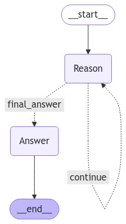

# langchain-reasoning-chain

<p align="center"
  <a href="https://github.com/billyvinning/langchain-reasoning-chain/actions?query=workflows:Unit Tests" target="_blank">
    
  </a>
  <a href="https://www.python.org" target="_blank">
    
  </a>
  <a href="https://github.com/pre-commit/pre-commit" target="_blank">
    
  </a>
  <a href="http://mypy-lang.org/" target="_blank">
    
  </a>
  <a href="https://github.com/astral-sh/ruff" target="_blank">
    
  </a>
  <a href="https://interrogate.readthedocs.io/en/latest/" target="_blank">
    
  </a>
  <a href="https://coverage.readthedocs.io/en/latest/" target="_blank">
    
  </a>
</p>


An implementation of a reasoning chain, or, dynamic Chain-Of-Thought (CoT), agent in LangGraph, following release of OpenAI's o1 model.

## Installation

Install directly from GitHub with `pip` via:

```bash
pip install git+https://github.com/billyvinning/langchain-reasoning-chain
```

Alternatively, install from a local clone with `pip` via:

```bash
git clone git@github.com:billyvinning/langchain-reasoning-chain.git
cd langchain-reasoning-chain
pip install .
```


## Usage


Firstly, initialise your favourite LLM; this example uses Gemini 1.5 Flash from Google's Vertex AI.

```python
from langchain_google_vertexai import ChatVertexAI

llm = ChatVertexAI(model_name="gemini-1.5-flash")
```

Then import this package and initialise the reasoning chain runnable:

```python
from langchain_reasoning_chain import create_reasoning_chain_agent

reasoning_chain = create_reasoning_chain_agent(llm, min_steps=..., max_steps=..., system_prompt=...)
```

The function `create_reasoning_chain_agent` has three optional arguments:

- `min_steps`: The minimum number of reasoning steps to execute before giving the LLM the chance to deliver the final answer.
- `max_steps`: The maximum number of reasoning steps to execute before forcing the LLM to deliver the final answer.
- `system_prompt`: The system prompt; though the default (found in `graph.py`) should be fine.


The agent's workflow can be visualised in Jupyter by executing the following:

```python
from IPython.display import Image, display

display(Image(reasoning_chain.get_graph(xray=True).draw_mermaid_png()))
```

<h1 align="center">
    <picture>
        
    </picture>
</h1>

The newly initialised reasoning chain may be used in the following way:

```python
events = reasoning_chain.stream(
    {"messages": [HumanMessage("How many Rs are in strawberry?")]},
    stream_mode="values",
)

for event in events:
    event["messages"][-1].pretty_print()

```

Which will print to screen something to the effect of the following:

```
================================ Human Message =================================

How many Rs are in strawberry?
================================== Ai Message ==================================

``json
{"title": "Counting the 'R's in 'Strawberry'", "reasoning": "To determine the number of 'R's in the word 'strawberry', we will methodically analyze each letter. \n\n1. **Analyzing the word:**  We see the word 'strawberry' contains the letters 's', 't', 'r', 'a', 'w', 'b', 'e', 'r', 'r', and 'y'. \n2. **Identifying 'R's:** We notice that the letter 'R' appears three times within the word:  'st**r**aw**b**e**rr**y'. \n3. **Final Count:** Based on our analysis, the word 'strawberry' contains **three** 'R's."}
``
================================== Ai Message ==================================

``json
{"title": "Verifying the Count of 'R's in 'Strawberry'", "reasoning": "The provided reasoning correctly identifies the 'R's in the word 'strawberry'. However, to ensure accuracy, let's re-examine the word using a different approach. \n\n1. **Visual Inspection:** By visually inspecting the word 'strawberry', we can directly identify the 'R's. We see that the letter 'R' appears three times: 'st**r**aw**b**e**rr**y'. \n2. **Logical Deduction:** We know that the letter 'R' appears in 'strawberry', and there are two 'R's in 'berry'.  Since the word 'straw' doesn't have 'R's, we can confirm that there are three 'R's in 'strawberry'. \n3. **Alternative Method:**  Let's count the letters in 'strawberry' and exclude those that are not 'R's: There are 10 letters in total. Excluding the letters 's', 't', 'a', 'w', 'b', 'e', and 'y', we are left with three 'R's. \n\nTherefore, our re-examination using different methods confirms that there are indeed **three** 'R's in the word 'strawberry'."}
``
================================== Ai Message ==================================

``json
{"title": "Confirming the Count of 'R's in 'Strawberry' with a Third Method", "reasoning": "The previous reasoning methods correctly identified the 'R's in the word 'strawberry'. However, to strengthen our confidence in the answer, we will employ yet another approach. \\n\\n1. **Character-by-Character Analysis:** We will methodically examine each character of the word 'strawberry' and count the instances of the letter 'R'. \\n2. **Counting 'R's:**  's' - not 'R'; 't' - not 'R'; 'r' - 'R'; 'a' - not 'R'; 'w' - not 'R'; 'b' - not 'R'; 'e' - not 'R'; 'r' - 'R'; 'r' - 'R'; 'y' - not 'R'.  We have found three 'R's. \\n3. **Final Verification:**  This third method reinforces the previous conclusions, leaving no doubt that the word 'strawberry' contains **three** 'R's."}
``
================================== Ai Message ==================================

``json
{"title": "Final Answer: There are three 'R's in 'strawberry'", "reasoning": "The previous three reasoning steps, while approaching the problem from different angles, consistently arrive at the same conclusion: there are three 'R's in the word 'strawberry'. This consistency across multiple methods provides strong evidence for the correctness of our answer. There are no other possible interpretations or alternative answers, as the word itself explicitly shows three 'R's. We can be confident in our final answer.", "next_action": "final_answer"}
``
================================== Ai Message ==================================

There are **three** 'R's in the word "strawberry".

```
🎉🎉🎉

## License

This project is licensed under the MIT license, see `LICENSE.md` for more information.
